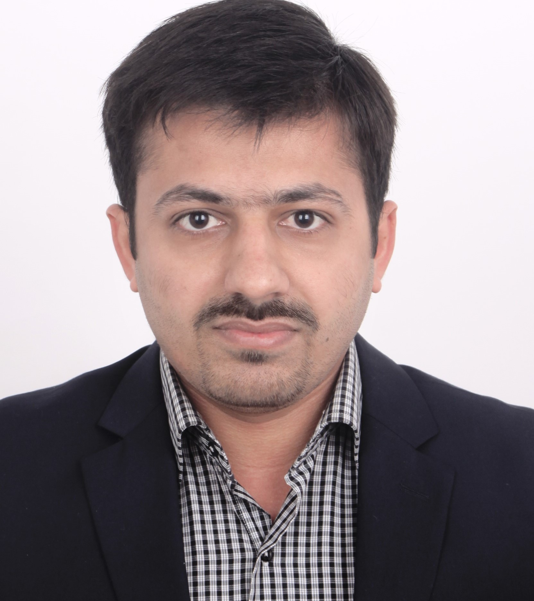

---
layout: page
title: "Welcome to my page"
---

**Short Bio** (Last update: November 2022).

  I have done Ph.D. from at [Shanghai Jiaotong University](https://en.sjtu.edu.cn/). My research interest mainly captures unsupervised image segmentation that spans from clustering techniques in machine learning to self-supervised representation learning in deep learning.  

I received my bachelor degree in Telecommunication Engineering from [The Islamia University](https://www.iub.edu.pk/), Pakistan in 2012. After that, I joined the Internet of Things Department, [Hohai University](https://en.hhu.edu.cn/), China in September 2014 (through the [Hohai Univeristy Scholarships](https://ie.hhu.edu.cn/7299/list.htm) as a masters student and graduated in June 2017. In 2016, I was awarded the Innovative Student Award. I conducted my master thesis on clustering based unsupervised image segmentation.

In September 2017, I joined the [Pattern Analysis and Machine Intelligence (PAMI) Lab](http://www.pami.sjtu.edu.cn/En/Home), [Shanghai Jiaotong University](https://en.sjtu.edu.cn/), China for my PhD to work on the improved partitional clustering based machine learning approaches and self-supervised deep feature learning. My Ph.D. was funded by [Shanghai Jiaotong University Scholarship](https://isc.sjtu.edu.cn/en/content.aspx?info_lb=44&flag=2). I joined the Sino-Pak centre of Artificial Intelligence in Pak-Austria Fachocshule in Haripur, Pakistan, as a research assistant in the framework of the Human Action based Anomaly recognition project [**Intellisurv**](https://paf-iast.edu.pk/spcai_intellisurvproject2/) from August 2021 until August 2022. The main responsibilities included data collection, data preprocessing, model development and deployment on edge device (Jetson Nano) for real-time anomaly recognition.  

